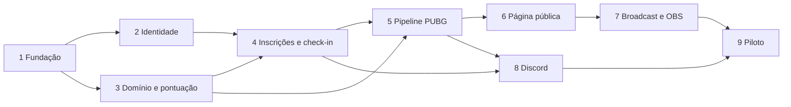

# Roadmap — lançamento v1 completo

**Criado:** 2026-08-20  
**Objetivo:** entregar um campeonato piloto de PUBG PC operado integralmente pela plataforma, com automação por exceção, página pública, Discord e pacote OBS.

## Estratégia de entrega

“Completo” significa cobrir o fluxo de um campeonato do início ao fim. Não significa construir todos os produtos futuros antes do piloto. Cada fase abaixo termina com algo verificável e integra-se ao mesmo núcleo modular.

Arquitetura inicial: monólito modular para regras e transações, aplicações separadas para web, worker, Discord e OBS bridge. Um módulo só vira microserviço quando escala, isolamento ou implantação independente justificarem o custo.

## Fase 1 — Fundação modular e ambientes

**Meta:** repositório executável, limites arquiteturais e infraestrutura local reproduzível.

### Entregas

- Monorepo pnpm/Turborepo com `web`, `api`, `worker`, `discord-bot` e pacotes compartilhados.
- Next.js App Router e NestJS/Fastify com health checks.
- PostgreSQL, Redis e armazenamento S3 compatível em ambiente local.
- Drizzle schema/migrations, contratos compartilhados e outbox transacional base.
- Configuração tipada, segredos fora do código, logs estruturados e rastreamento.
- CI com lint, typecheck, testes, build por pacote afetado e imagens Docker.
- Regras de dependência impedindo domínio de importar infraestrutura ou aplicações.

### Verificação

- Um comando sobe o ambiente local completo.
- CI detecta importação proibida e migração inconsistente.
- Web, API e worker publicam health/readiness separados.

**Requisitos:** NFR-001, NFR-004, NFR-005, NFR-007, NFR-009, NFR-010.

## Fase 2 — Identidade, organizações e autorização

**Meta:** usuários entram com segurança e colaboram sem compartilhar credenciais.

### Entregas

- Discord OAuth2, entrada alternativa por e-mail e sessões revogáveis.
- Organizações, convites e associação de usuários.
- RBAC por organização/campeonato: proprietário, administrador, árbitro, inscrições, transmissão e analista.
- Guardas globais, rotas públicas explícitas e matriz de permissões testada.
- Auditoria de convites, funções e alterações sensíveis.

### Verificação

- Cada função completa somente suas ações autorizadas.
- Tentativas entre organizações são negadas e registradas.
- Revogação encerra acesso sem afetar outros membros.

**Requisitos:** AUTH-001–006, ORG-001–005, AUD-001, NFR-005.

## Fase 3 — Domínio do campeonato e motor de pontuação

**Meta:** modelar qualquer campeonato solo, duo ou squad previsto para a v1.

### Entregas

- Campeonato, etapas, grupos, partidas, mapas, equipes, jogadores e elencos.
- Qualificatórias, semifinais e final; avanço por grupo/geral e wildcards.
- Carregamento ou reinício de pontos entre etapas.
- Motor puro de colocação, eliminações, bônus, penalidades e desempates.
- Versionamento de regras, modelos reutilizáveis e memória de cálculo.
- Progressão automática e bloqueios para mudanças destrutivas.

### Verificação

- Cenários de solo, duo e squad produzem classificação determinística.
- Alterar uma regra cria versão nova sem reescrever resultados anteriores.
- Critérios de desempate passam por casos de empate completo e parcial.

**Requisitos:** CMP-001–010, SCR-001–009, RES-001–004, AUD-002.

## Fase 4 — Inscrições, pagamento manual, elencos e check-in

**Meta:** substituir formulários e planilhas do organizador antes da primeira partida.

### Entregas

- Fluxos diferentes para solo e capitão de duo/squad.
- Validação de nick/accountId PUBG, confirmação e reivindicação de perfil.
- Upload privado de comprovante Pix, fila de aprovação e lista de espera.
- Titulares, reservas, substituições, prazo de roster e prevenção de duplicidade.
- Check-in, ausentes, liberação temporizada de ID/senha e registro de visualização.
- Estados operacionais da partida e pausas de automação.

### Verificação

- Um campeonato piloto fecha inscrições e elencos sem planilha externa.
- Comprovantes não aparecem em superfícies públicas.
- Credenciais da sala não são acessíveis antes da hora ou por não inscritos.

**Requisitos:** REG-001–010, PAY-001, OPS-001–007, NFR-006.

## Fase 5 — Pipeline PUBG e reconciliação

**Meta:** encontrar a partida correta, processá-la uma vez e parar com segurança quando houver dúvida.

### Entregas

- Adaptador oficial PUBG, proteção de chave, limites, cache, retentativa e telemetria.
- Seleção e substituição de três sentinelas.
- Job agendado em lote e interseção de `matchId`.
- Validação de partida personalizada, janela, modo, mapa e elenco.
- Política 3/3 automática, 2/3 revisão e 1/3 bloqueada.
- Payload bruto imutável, modelo normalizado, deduplicação e idempotência.
- Busca forçada, vínculo manual, fila de revisão e métricas de atraso.
- Agregações de eliminações, dano, ADR, knocks, assistências, revives, sobrevivência e vitórias.

### Verificação

- Fixtures reais/anônimas cobrem partida válida, duplicada, atrasada e incorreta.
- Reprocessar a mesma partida não duplica pontos nem eventos.
- Falha da API preserva último estado e retoma sem intervenção.

**Requisitos:** PUBG-001–015, RES-005–008, AUD-003, NFR-001–002, NFR-010.

## Fase 6 — Página pública, perfis e identidade

**Meta:** oferecer ao público uma experiência melhor que uma tabela isolada.

### Entregas

- Slug público e estados rascunho/publicado.
- Twitch incorporada com modos ao vivo e pós-live.
- Visão geral, classificação, partidas, jogadores, equipes e regras.
- Perfis por jogador/equipe e detalhamento por partida/etapa.
- Líderes, atualização sem reload, idade do dado e estados de processamento.
- Temas controlados, upload de logo/banner/patrocinadores e paleta com contraste.
- Responsividade, acessibilidade, metadados e cards compartilháveis.

### Verificação

- Desktop e celular suportam tabelas com conteúdo mínimo, típico e extremo.
- Twitch indisponível não bloqueia classificação.
- Nenhum dado incompleto é apresentado como zero confirmado.

**Requisitos:** PUB-001–012, BRD-001–007, NFR-003.

## Fase 7 — Pacote de broadcast e integração OBS

**Meta:** operar uma transmissão Twitch profissional usando dados oficiais já aprovados.

### Entregas

- Sistema de overlays transparentes 1920x1080 com conexão resiliente.
- Todas as famílias de tela definidas no brief, habilitadas por configuração.
- Painel de transmissão com prévia, estado, “colocar no ar” e parada de emergência.
- Modo assistido e roteiros automáticos interrompíveis.
- Animações de entrada/saída e áreas seguras.
- OBS bridge local, pareamento temporário e obs-websocket com autenticação.
- Controle de cena/visibilidade e indicador de conexão.

### Verificação

- Atualizar uma partida aprovada atualiza todas as fontes abertas sem reload.
- Perder rede mantém último estado, sinaliza atraso e reconecta.
- O servidor nunca recebe nem armazena a senha local do OBS.
- O operador sempre consegue interromper uma sequência automática.

**Requisitos:** OBS-001–011, NFR-002–003, NFR-005.

## Fase 8 — Bot Discord e salas automáticas

**Meta:** levar operação e comunicação ao ambiente onde a comunidade já está.

### Entregas

- Instalação OAuth2 do bot com menor privilégio.
- Mapeamento de canais públicos, operacionais e alertas.
- Publicações de inscrição, check-in, agenda, resultados, classificação e cards.
- Alertas privados de revisão e falhas.
- Categoria, cargos e canais de texto/voz privados por equipe.
- Distribuição temporizada de credenciais.
- Reconciliação de canais/cargos removidos e arquivamento ao encerrar.

### Verificação

- Equipes não enxergam canais adversários; organização enxerga todos.
- Remover uma permissão gera diagnóstico acionável sem loop destrutivo.
- Repetir uma automação não duplica canal, cargo ou mensagem idempotente.

**Requisitos:** DSC-001–010, NFR-005, NFR-007.

## Fase 9 — Hardening, piloto e lançamento

**Meta:** provar o fluxo completo em campeonato real e lançar com recuperação operacional.

### Entregas

- Testes E2E do cadastro ao campeão, incluindo correção e republicação.
- Testes de carga da página pública, overlays e fila durante rodada.
- Matriz de falhas PUBG/Discord/Twitch/OBS e procedimentos de recuperação.
- Backups, restauração ensaiada, retenção e limpeza de dados privados.
- Observabilidade e alertas para latência de importação, jobs e conexões.
- Onboarding do organizador e checklist de ensaio da transmissão.
- Campeonato piloto com o streamer que originou a ideia.
- Registro de feedback, correções críticas e decisão de disponibilidade pública.

### Verificação

- Todos os nove critérios de lançamento em `REQUIREMENTS.md` passam.
- Uma pessoa nova configura um campeonato usando o onboarding.
- O piloto conclui sem planilha como fonte paralela de verdade.

**Requisitos:** NFR-001–010 e critérios de lançamento v1.

## Dependências entre fases

## Cobertura dos requisitos

| Grupo | Fase principal |
|---|---:|
| AUTH, ORG | 2 |
| CMP, SCR | 3 |
| REG, PAY, OPS | 4 |
| PUBG, RES, AUD | 5 |
| PUB, BRD | 6 |
| OBS | 7 |
| DSC | 8 |
| NFR e lançamento | 1 e 9 |

## Portões de decisão

- **Após a Fase 3:** confirmar regras e formatos com organizador real antes de integrar a API.
- **Após a Fase 5:** medir latência real de partidas personalizadas e ajustar polling/revisão.
- **Após a Fase 6:** validar página pública em desktop/celular com dados de um campeonato completo.
- **Após a Fase 7:** ensaio fechado no OBS antes de conceder modo automático.
- **Após a Fase 9:** decidir modelo de preço, nome/domínio definitivo e abertura pública.

## Evolução pós-v1

- Pix automático e distribuição de premiação.
- Aplicativo móvel e notificações push.
- Overlays verticais e geração automática de clipes.
- Rankings entre campeonatos, temporadas comunitárias e perfis globais.
- Extração de módulos para microserviços apenas quando métricas indicarem necessidade.
