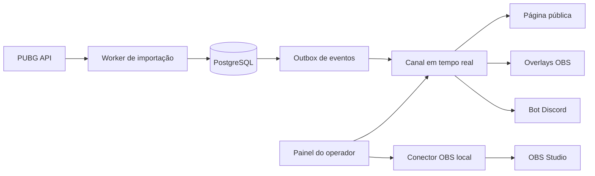

# Experiência pública e pacote de transmissão

## 1. Trabalho e público

A página pública é o centro do campeonato para espectadores da Twitch, participantes e pessoas que chegam por um link no Discord. Ela precisa responder rapidamente: “o que está acontecendo?”, “quem está ganhando?”, “como cada jogador foi?” e “quando é a próxima partida?”.

O painel é uma superfície de operação para organizadores e equipe de transmissão. Nele, velocidade, prevenção de erro e estado explícito são mais importantes que expressão visual.

Os overlays são superfícies de broadcast: comunicam uma informação por vez, em poucos segundos, sem competir com o jogo, câmeras ou narração.

## 2. Resultado e prova

- A classificação geral é o dado central e deve permanecer acessível em um clique.
- Toda pontuação pública pode ser explicada por partida e regra aplicada.
- Estatísticas usam dados importados e mostram quando estão incompletas ou aguardando API.
- O espectador reconhece o campeonato por logo, cor e patrocinadores, mas encontra a mesma estrutura de navegação em qualquer evento.
- A transmissão e a página mudam de prioridade conforme o estado do evento, sem reorganizações surpreendentes.

## 3. Direção selecionada

Referências funcionais: Twire para separação entre classificação, partidas e jogadores; Wasdefy para operação de competição. Nenhuma delas deve ser copiada visualmente.

A direção é **broadcast editorial modular**: fundo escuro e controlado, tipografia condensada apenas em títulos curtos, números tabulares muito legíveis, cor do campeonato como sinal e não como preenchimento constante. A identidade do organizador entra por ativos e tokens; componentes, contraste e ritmo permanecem protegidos.

O momento focal da página durante a live é a relação entre transmissão e classificação. Depois da live, a classificação assume o topo. No OBS, o momento focal muda conforme a tela selecionada e nunca tenta mostrar todas as métricas simultaneamente.

## 4. Arquitetura da página pública

### Navegação principal

1. **Visão geral**
2. **Classificação**
3. **Partidas**
4. **Jogadores**
5. **Equipes** — escondida em solo quando não agrega valor
6. **Regras**

### Visão geral durante a transmissão

```text
┌──────────────── campeonato / etapa / status ────────────────┐
│                                                             │
│  Twitch 16:9                         classificação resumida  │
│                                      próxima partida         │
│                                      atualização dos dados   │
│                                                             │
├──────── líderes ────────┬──────── última partida ────────────┤
│ eliminações | dano      │ vencedor | mapa | resultado        │
├─────────────────────────┴────────────────────────────────────┤
│ classificação completa / chamada para detalhes              │
└──────────────────────────────────────────────────────────────┘
```

### Visão geral fora da transmissão

- Cabeçalho do campeonato e estado final/agenda seguinte.
- Classificação completa como primeiro bloco substancial.
- Pódio, destaques e última partida.
- Player da Twitch recolhido ou substituído por link/estado offline.

### Classificação

Colunas prioritárias: posição, participante, partidas, vitórias, eliminações, pontos de colocação, penalidades e total. Variações secundárias ficam em detalhe expansível, não em uma tabela horizontal interminável.

- Destaque discreto para líder e zona de classificação/corte.
- Filtros por etapa, grupo e período.
- Linha abre a ficha da equipe/jogador sem perder contexto.
- Mobile usa linhas em duas camadas e cabeçalho fixo, não uma versão minúscula da tabela desktop.

### Jogadores

Indicadores principais: eliminações, dano total, dano médio por partida, knocks, assistências, revives, sobrevivência média, vitórias e partidas. Headshots não entram no resumo principal.

- Ranking ordenável e filtro por equipe/etapa.
- Perfil individual com evolução e tabela partida a partida.
- Dados ausentes usam “indisponível”, nunca zero fictício.

### Equipes

- Elenco atual e histórico de substituições.
- Pontuação, vitórias, eliminações, dano e consistência por partida.
- Evolução da posição ao longo da etapa.
- Detalhe de contribuição de cada integrante sem criar um “rating” opaco na v1.

### Partidas

- Cartões compactos por queda: número, mapa, horário, estado e vencedor.
- Detalhe com classificação completa, eliminações, pontos e participantes.
- Estado “aguardando API” e “em revisão” é público sem expor detalhes internos.

## 5. Sistema de temas

- Três ou quatro temas base com composição estável.
- Tokens por campeonato: logo, banner, cor principal, cor de apoio, patrocinadores e preferência clara/escura quando suportada.
- Paleta sugerida a partir da logo, sempre corrigida para contraste.
- Prévia em página, card e overlay antes de publicar.
- Sem editor livre de arrastar; áreas reservadas impedem colisões e inconsistências entre telas.

## 6. Pacote OBS

### Famílias de tela

| Família | Telas |
|---|---|
| Pré-evento | abertura, contagem regressiva, agenda, rotação de mapas, patrocinadores |
| Participantes | equipes, escalações, slots, jogador/equipe em destaque, comparação |
| Competição | próxima partida, classificação completa, classificação compacta, corte/classificados |
| Pós-partida | processamento, resultado da queda, Chicken Dinner, líderes, maior dano, MVP |
| Operação | ticker, aviso, pausa, retorno em breve, problema técnico controlado |
| Encerramento | pódio, campeão, agradecimentos, redes e patrocinadores |

Cada tela tem uma única mensagem principal. Métricas secundárias aparecem em no máximo uma camada de apoio.

### Atualização e controle



- O overlay nunca consulta a PUBG API diretamente.
- Ao perder conexão, mantém o último estado válido e tenta reconectar.
- O painel mostra prévia, estado do dado e qual tela está no ar.
- Modo assistido prepara a próxima tela e exige confirmação.
- Modo automático segue um roteiro configurado e sempre oferece interrupção manual.
- O conector local usa pareamento temporário e autenticação do obs-websocket.

## 7. Discord como extensão da experiência

- Uma categoria por campeonato, com canais públicos/operacionais mapeados.
- Um cargo, canal de texto e canal de voz privados por equipe.
- Organização enxerga todos; equipes não enxergam adversários.
- Check-in, credenciais e mudanças críticas chegam ao canal correto.
- Resultados públicos usam link e card; informações completas permanecem na página.
- Ao encerrar, canais são arquivados antes de qualquer remoção destrutiva.

## 8. Estados e limites

### Estados obrigatórios

- Primeira configuração sem logo, Twitch ou equipes.
- Inscrições vazias, lotadas, encerradas e em lista de espera.
- Twitch offline, ao vivo, inválida ou bloqueada.
- PUBG aguardando, atrasada, indisponível, 3/3, 2/3 e divergente.
- Resultado em revisão, corrigido, aprovado e republicado.
- Overlay conectado, reconectando e desatualizado.
- Discord sem permissão, canal removido e reconciliação concluída.
- OBS não pareado, offline, autenticando e conectado.

### Faixas de conteúdo

- Solo: dezenas de jogadores; duo/squad: elencos e reservas por equipe.
- Nomes curtos e extremamente longos, caracteres internacionais e logos ausentes.
- De uma única etapa a qualificatórias com vários grupos e final.
- De uma a dezenas de partidas por campeonato.
- Zero ou vários patrocinadores, sem deixar espaços quebrados.

## 9. Responsividade, acessibilidade e desempenho

- Página pública atende desktop e celular; painel prioriza desktop, mas ações urgentes funcionam no celular.
- Overlays têm layout fixo 1920x1080 e áreas seguras documentadas.
- Teclado, foco visível, leitores de tela, contraste AA e redução de movimento no site/painel.
- Números usam alinhamento tabular; significado nunca depende apenas de cor.
- Twitch carrega sem bloquear classificação e conteúdo essencial.
- Animações do overlay têm entrada/saída curta e não ficam repetindo sem propósito.

## 10. Limites e antiobjetivos

- Não reproduzir a página como uma planilha densa.
- Não colocar stream, tabela completa, líderes e regras competindo no mesmo primeiro viewport mobile.
- Não usar estética oficial da PUBG ou arte gerada como se fosse material licenciado.
- Não ocultar atraso da API atrás de um indicador genérico “ao vivo”.
- Não automatizar troca de cenas de forma irreversível ou sem botão de parada.
- Não criar versões verticais no lançamento.

## 11. Decisões abertas

- Nome e domínio do produto.
- Identidade visual da plataforma e seleção dos temas iniciais.
- Provedor de hospedagem e armazenamento.
- Modelo de sustentabilidade/preço para organizadores.
- Política de retenção de comprovantes e dados brutos da telemetria.
